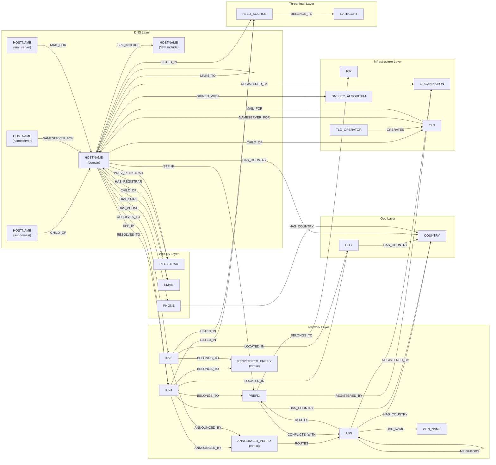

# WhisperGraph Entity Relationship Map

## Verified Traversal Chains

### DNS Resolution Chain
```
HOSTNAME -[:RESOLVES_TO]-> IPV4 -[:BELONGS_TO]-> PREFIX <-[:ROUTES]- ASN -[:HAS_NAME]-> ASN_NAME
```

### DNS Hierarchy
```
HOSTNAME -[:CHILD_OF]-> HOSTNAME -[:CHILD_OF]-> TLD
Example: www.google.com → google.com → com
```

### GeoIP Chain
```
IPV4 -[:LOCATED_IN]-> CITY -[:HAS_COUNTRY]-> COUNTRY
IPV6 -[:LOCATED_IN]-> CITY -[:HAS_COUNTRY]-> COUNTRY
HOSTNAME -[:RESOLVES_TO]-> IPV4 -[:LOCATED_IN]-> CITY -[:HAS_COUNTRY]-> COUNTRY
```

### BGP/Routing
```
ASN -[:ROUTES]-> PREFIX
ASN -[:PEERS_WITH]-> ASN
ASN -[:NEIGHBORS]-> ASN (threat intel layer)
ASN -[:HAS_COUNTRY]-> COUNTRY
ASN -[:REGISTERED_BY]-> ORGANIZATION
PREFIX -[:BELONGS_TO]-> RIR
PREFIX -[:REGISTERED_BY]-> ORGANIZATION
PREFIX -[:CONFLICTS_WITH]-> ASN (MOAS conflict, virtual)
```

### BGP Virtual
```
IPV4 -[:ANNOUNCED_BY]-> ANNOUNCED_PREFIX -[:ROUTES]-> ASN
IPV6 -[:ANNOUNCED_BY]-> ANNOUNCED_PREFIX -[:ROUTES]-> ASN
IPV4/IPV6 -[:BELONGS_TO]-> REGISTERED_PREFIX
```

### DNS Security
```
HOSTNAME <-[:NAMESERVER_FOR]- HOSTNAME
TLD -[:NAMESERVER_FOR]-> HOSTNAME
HOSTNAME <-[:MAIL_FOR]- HOSTNAME
TLD -[:MAIL_FOR]-> HOSTNAME
HOSTNAME -[:SPF_INCLUDE]-> HOSTNAME
HOSTNAME -[:SPF_IP]-> IPV4/PREFIX
HOSTNAME -[:SPF_A]-> HOSTNAME
HOSTNAME -[:SPF_MX]-> HOSTNAME
HOSTNAME -[:SPF_EXISTS]-> HOSTNAME
HOSTNAME -[:SPF_REDIRECT]-> HOSTNAME
HOSTNAME -[:SIGNED_WITH]-> DNSSEC_ALGORITHM
```

### Web/CNAME
```
HOSTNAME -[:LINKS_TO]-> HOSTNAME
HOSTNAME -[:ALIAS_OF]-> HOSTNAME
```

### WHOIS
```
HOSTNAME -[:HAS_REGISTRAR]-> REGISTRAR
HOSTNAME -[:PREV_REGISTRAR]-> REGISTRAR
HOSTNAME -[:HAS_EMAIL]-> EMAIL
HOSTNAME -[:HAS_PHONE]-> PHONE
HOSTNAME -[:REGISTERED_BY]-> ORGANIZATION
EMAIL -[:CHILD_OF]-> HOSTNAME (email domain association)
```

### TLD Operators
```
TLD_OPERATOR -[:OPERATES]-> TLD
```

### Country Association
```
HOSTNAME -[:HAS_COUNTRY]-> COUNTRY
IPV4 -[:HAS_COUNTRY]-> COUNTRY
PHONE -[:HAS_COUNTRY]-> COUNTRY
```

### Threat Intelligence
```
IPV4/IPV6/HOSTNAME -[:LISTED_IN]-> FEED_SOURCE
FEED_SOURCE -[:BELONGS_TO]-> CATEGORY
ASN -[:NEIGHBORS]-> ASN
PREFIX -[:CONFLICTS_WITH]-> ASN (MOAS conflict, virtual)
```

## Full 5-Hop Investigation Chain (most common pattern)

```
HOSTNAME → RESOLVES_TO → IPV4 → BELONGS_TO → PREFIX ← ROUTES ← ASN → HAS_NAME → ASN_NAME
```

Example query:
```cypher
MATCH (h:HOSTNAME {name: "www.google.com"})-[:RESOLVES_TO]->(ip:IPV4)
      -[:BELONGS_TO]->(p:PREFIX)<-[:ROUTES]-(a:ASN)-[:HAS_NAME]->(n:ASN_NAME)
RETURN h.name, ip.name, p.name, a.name, n.name
```

## Entity Relationship Diagram



**Notes**:
- All nodes in the DNS Layer share the `HOSTNAME` label - the role annotations show how the same label serves different functions via different edge types.
- Both `IPV4` and `IPV6` have `BELONGS_TO` edges to `PREFIX` and `LOCATED_IN` edges to `CITY`.
- `TLD` nodes have outgoing `NAMESERVER_FOR` and `MAIL_FOR` edges to HOSTNAME (zone file records).
- `SPF_IP` edges can target both `IPV4` (for individual addresses) and `PREFIX` (for CIDR blocks).
- `EMAIL` nodes use `CHILD_OF` edges to associate with their domain HOSTNAME (e.g., `email:dns-admin@google.com → google.com`).
